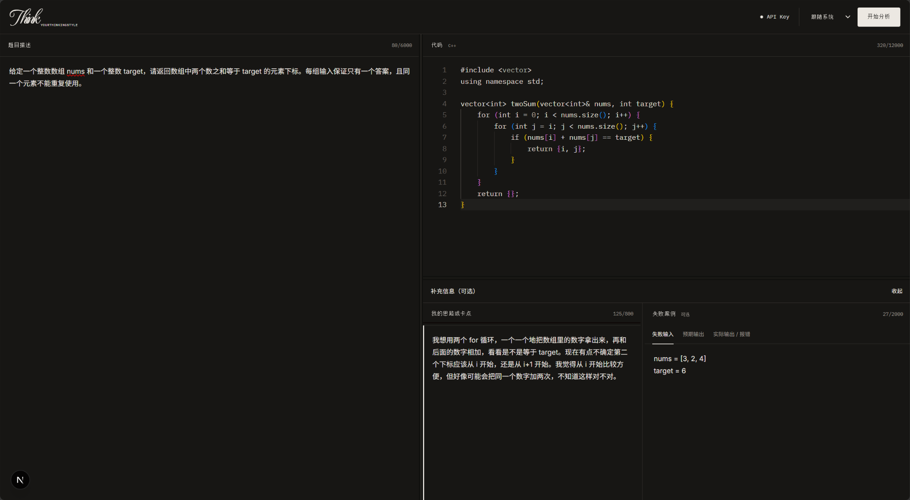
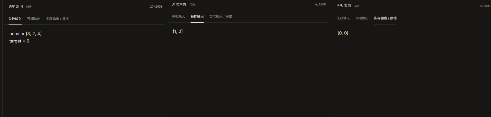
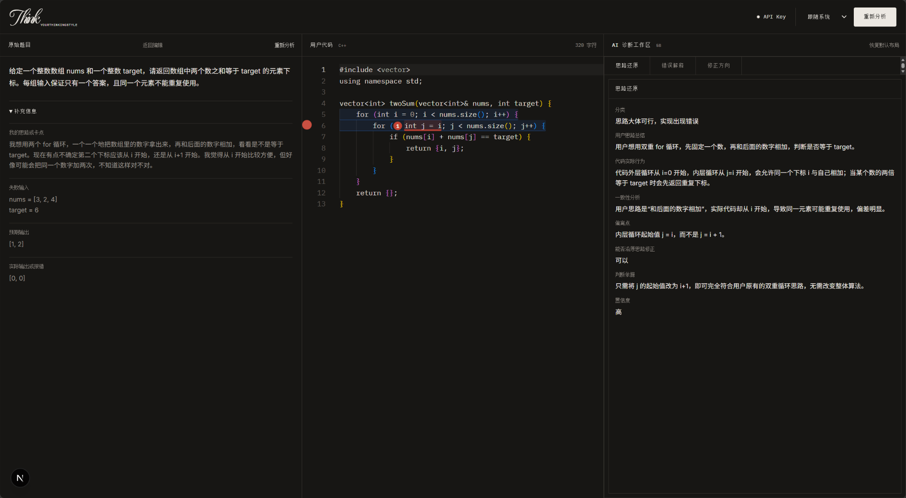
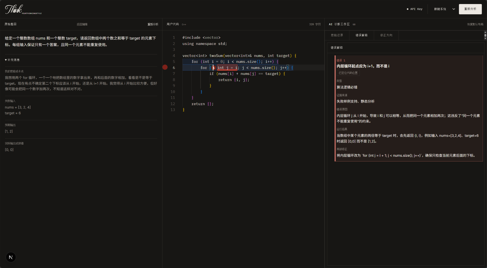
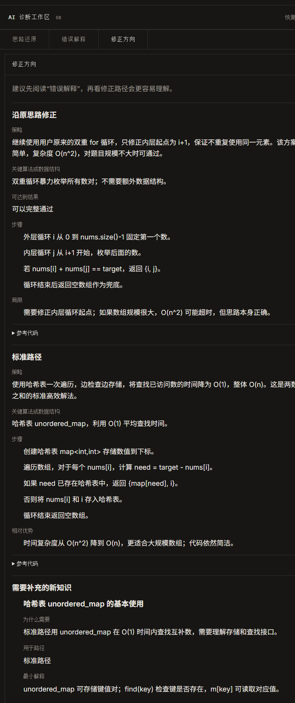
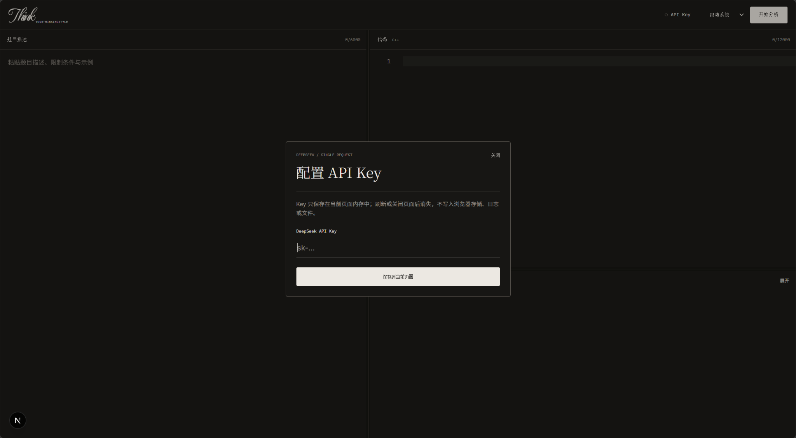

# YourThinkingStyle

> 不替你重写思路，先帮你看清它在哪里走偏。

YourThinkingStyle 是一个面向 **C++ 算法学习** 的 AI 代码诊断工具。

很多 AI 编程工具在发现错误后，会直接给出一份正确答案。这个项目更关注另一件事：**你原本是怎么想的、代码实际上做了什么，以及两者从哪里开始出现偏差。**

它把题目、当前代码、用户自己的思路和失败案例放进同一个诊断上下文里，先还原思路，再解释具体错误，最后给出两层修正路径：

- **沿原思路修正**：尽量保留用户原来的解法，只修真正导致失败的位置，先把代码补成可运行、基本符合题意的版本。
- **标准路径**：再结合数据规模、时间复杂度和题目要求，引出更合适的算法，并补充继续理解所需要的新知识。

## 分析流程

```text
题目 + 当前代码 + 用户思路 + 失败证据
              ↓
           思路还原
              ↓
        错误定位与解释
              ↓
        沿原思路完成修正
              ↓
     标准路径与复杂度比较
              ↓
        需要补充的新知识
```

### 1. 输入题目、代码与补充信息



分析前，用户可以输入题目和当前代码，也可以补充“我的思路 / 卡点”和失败案例。补充信息不是必填项，但它们能让诊断更贴近用户真正的解题过程，而不是只对最终代码做静态点评。

### 2. 用失败案例把“哪里错了”变成具体证据



失败案例会显式记录 **失败输入、预期输出、实际输出 / 报错**。上面的 Two Sum 示例中，`nums = [3, 2, 4]`、`target = 6` 的预期结果是 `[1, 2]`，当前代码却返回 `[0, 0]`。

这使模型可以把错误解释建立在具体运行证据上，而不是笼统地猜测“这里可能有问题”。

### 3. 分析完成后的默认界面：先还原用户思路



**分析完成后，默认进入「思路还原」视图。**

左侧保留原题、用户补充的思路和失败证据；中间保留用户原始代码；右侧先回答三个问题：

1. 用户原本打算怎么做？
2. 代码实际执行的逻辑是什么？
3. 两者的偏差从哪里开始？

在这个例子里，用户的想法是“固定一个数，再和后面的数相加”，但内层循环从 `j = i` 开始，使同一个元素有机会被重复使用。诊断不会先把双重循环整个推翻，而是先指出**思路本身基本可行，问题出在实现细节**。

### 4. 点击错误，直接跳到对应代码位置



「错误解释」不只是展示一张错误卡片。**点击具体错误后，编辑器会跳转并高亮对应代码位置**，同时右侧保留错误类型、证据来源、错误原因、运行后果和局部修正建议。

这张图不是分析完成后的默认状态，而是用户主动点击错误后的联动状态：诊断结果与源代码位置直接对应，减少在大段代码和大段解释之间来回寻找的成本。

### 5. 修正方向：先救活原思路，再教更好的方法



修正阶段会同时保留两条路径。

**沿原思路修正**：继续使用用户原来的双重 `for` 循环，只把内层起点从 `j = i` 改为 `j = i + 1`，避免重复使用同一元素。这个方案仍然是 `O(n²)`，但逻辑正确，在数据规模允许时可以完整通过。

**标准路径**：进一步解释为什么哈希表可以把查找互补数的过程降到平均 `O(1)`，从而把整体复杂度降到 `O(n)`。如果用户还没有掌握这条路径需要的知识，系统会继续指出下一步应该补什么，例如本例中的 `unordered_map` 基本使用。

目标不是“把标准答案贴出来”，而是让用户能够看到：**我当前的办法怎么修、它为什么仍有局限、下一种方法为什么更好，以及为了真正复现它我还缺什么知识。**

## API Key 与 Local 模式



Local 模式下，用户在页面中填写自己的 DeepSeek API Key。Key **只保存在当前页面内存中**，只随当前分析请求发送；刷新或关闭页面后消失，不写入浏览器持久存储、服务端日志或仓库文件。

## 核心特点

- **先理解，再纠错**：先还原用户的解题思路，而不是一上来覆盖成标准答案。
- **失败证据是一等输入**：把输入、预期输出和实际结果直接纳入诊断上下文。
- **错误与源码位置联动**：点击错误即可跳转并高亮对应代码位置。
- **两层修正路径**：先沿原思路修到能跑，再结合复杂度和题目约束引出更优算法。
- **继续补知识，而不只补代码**：明确指出标准路径需要的新数据结构或算法知识。
- **结构化结果与二次校验**：模型响应不是原样贴到页面，而是经过结构化解析与 Zod 校验后再进入诊断界面。

## 当前状态

**Working MVP / In Development**

目前核心诊断链路已经可以运行：

- C++ 题目与代码输入
- Monaco Editor 代码编辑与定位
- 用户思路 / 卡点补充
- 失败案例输入
- DeepSeek 模型调用
- 结构化分析结果与 Zod 校验
- 「思路还原 / 错误解释 / 修正方向」三段诊断
- 错误位置标注与点击跳转
- Local / Hosted 两种运行模式

Hosted 版本包含邮箱账户、个人资料、头像、诊断历史和使用统计，并使用 PostgreSQL 持久化；项目仍在继续完善诊断流程、交互体验和 Agent 化工作流。

## 技术栈

- **Next.js 16 / React 19 / TypeScript 5**
- **Tailwind CSS**
- **Monaco Editor**
- **Zod** — 模型结构化输出与结果校验
- **DeepSeek API**
- **Drizzle ORM / PostgreSQL**
- **Better Auth**

浏览器界面与服务端 API 共用 TypeScript，不另设 Express 后端。

## 快速开始

要求 **Node.js 24 LTS**，依赖版本由 `package-lock.json` 锁定。

```bash
npm ci
```

Windows：

```powershell
copy .env.example .env.local
npm run dev
```

macOS / Linux：

```bash
cp .env.example .env.local
npm run dev
```

打开：

```text
http://localhost:3000
```

Local 模式不需要账户或数据库。DeepSeek API Key 在页面中填写即可，不需要把个人 Key 写入 `.env.local`。

<details>
<summary><strong>Hosted 本机开发</strong></summary>

复制环境变量：

```bash
copy .env.hosted.example .env.hosted
```

启动 PostgreSQL 和 Mailpit，并应用数据库迁移：

```bash
npm run infra:up
npm run db:migrate
npm run db:check
npm run dev:hosted
```

Mailpit 管理页面：

```text
http://localhost:8025
```

Hosted 环境至少需要配置 `DATABASE_URL`、长度不小于 32 个字符的 `BETTER_AUTH_SECRET` 和 `BETTER_AUTH_URL`。真实环境变量只应保存在本地或部署平台。

</details>

<details>
<summary><strong>常用命令</strong></summary>

```bash
npm run dev          # Local 开发服务器
npm run dev:hosted   # Hosted 开发服务器
npm run infra:up     # 启动 PostgreSQL 与 Mailpit
npm run infra:down   # 停止本地基础设施
npm run db:migrate   # 应用数据库迁移
npm run db:check     # 检查数据库配置
npm run lint         # ESLint
npm run build        # 生产构建
npm test             # 完整测试
```

</details>

## 目录

```text
src/                 应用页面、组件、诊断逻辑与服务端代码
tests/               单元测试与集成测试
drizzle/             数据库迁移
scripts/             统计与 Hosted 维护脚本
docs/screenshots/    README 产品截图
public/              静态资源
```

---

YourThinkingStyle 目前仍在持续迭代。这个项目最想验证的不是“AI 能不能做出一道算法题”，而是：**AI 能不能在不抢走思考过程的前提下，帮助学习者看清自己的思路、修正它，再真正走到更好的解法。**
